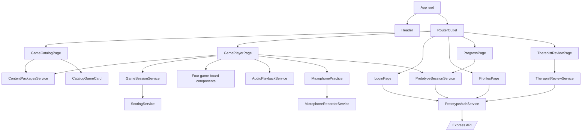
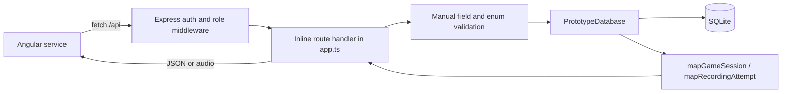
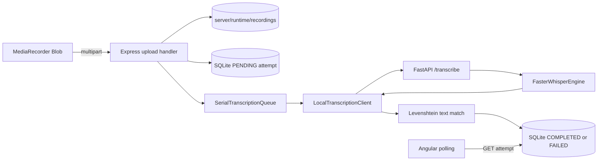

# Artikulino Architecture Explained

## 1. Project Overview

Artikulino is a localhost-only thesis prototype for child-friendly listening and pronunciation
practice. It is not a diagnostic or clinical system. The current repository contains three
cooperating applications:

1. an Angular 21 single-page application in `src/`;
2. a TypeScript Express 5 API with SQLite persistence in `server/`;
3. a Python FastAPI worker with `faster-whisper` for local Croatian transcription in
   `transcription/`.

The implemented product features are:

- a public home page and public game catalog;
- 34 static content packages across four game types;
- parent and therapist demo authentication;
- fictional child profiles;
- configurable listening, sound-recognition, sound-position, and pronunciation games;
- browser speech synthesis and optional packaged audio playback;
- microphone recording for pronunciation games only;
- SQLite-backed sessions, recording metadata, transcripts, and therapist reviews;
- recording files stored locally under the ignored `server/runtime/recordings/` directory;
- local Croatian transcription and normalized text-match percentages;
- parent progress and therapist review pages;
- Angular, Express, database, workflow, and Python worker tests.

> **Important correction to the original analysis request:** this codebase does not contain Spring
> Boot. There are no Spring controllers, JPA repositories, Java entities, or Spring DTO classes.
> The equivalent responsibilities are implemented by Express route handlers, the
> `PrototypeDatabase` class, TypeScript interfaces, and SQLite rows.

## 2. Repository Structure

```text
Artikulino_New/
├── src/                         Angular application
│   ├── main.ts                  Browser bootstrap
│   ├── main.css                 Global tokens and reusable visual rules
│   └── app/
│       ├── app.ts               Root shell
│       ├── app.config.ts        Router providers
│       ├── app.routes.ts        Top-level lazy routes
│       ├── core/                Auth, route guards, shared models, API services
│       ├── shared/              Reusable recording components and browser services
│       └── features/            Home, auth, profiles, games, progress, therapist UI
├── public/assets/               Static game, theme, catalog, and decoration media
├── server/
│   ├── src/app.ts               Express middleware, validation, and API route handlers
│   ├── src/database.ts          SQLite schema, migrations, queries, and response mapping
│   ├── src/transcription.ts     Worker client, serial queue, and text matching
│   ├── src/security.ts          Password and bearer-token hashing
│   ├── src/index.ts             API process entry point
│   ├── src/reset.ts             Runtime reset and reseed command
│   └── tests/                   API, transcription, and integrated workflow tests
├── transcription/
│   ├── app.py                   FastAPI endpoints and upload validation
│   ├── engine.py                Lazy faster-whisper adapter
│   ├── config.py                CPU/Croatian model settings
│   └── test_app.py              Worker tests
├── scripts/                     Media validation utilities
├── docs/                        Architecture, privacy, QA, setup, and design records
├── angular.json                 Angular build/serve/test configuration
├── proxy.conf.json              `/api` proxy from Angular to Express
├── package.json                 Frontend and whole-prototype scripts
└── server/package.json          Express build, test, dev, and reset scripts
```

The repository deliberately keeps runtime data out of Git. `.gitignore` excludes Angular build
output, Node modules, Python virtual environments/caches, `server/dist/`, and `server/runtime/`.

## 3. Frontend Architecture

### Angular bootstrap and root shell

`src/main.ts` calls `bootstrapApplication(App, appConfig)`. `src/app/app.config.ts` provides the
router and restores the scroll position to the top after navigation. `src/app/app.ts` is a small
root component containing:

- the keyboard skip link;
- the shared `Header` component;
- `<router-outlet>` inside `<main id="main-content">`.

All pages use standalone components and `ChangeDetectionStrategy.OnPush`. There is no Angular
NgModule-based feature structure.

### Routing

`src/app/app.routes.ts` defines the main lazy routes:

| Route                | Component/route file  | Access                     |
| -------------------- | --------------------- | -------------------------- |
| `/`                  | `HomePage`            | Public                     |
| `/igre`              | `GAME_ROUTES`         | Public catalog             |
| `/igre/:packageId`   | `GamePlayerPage`      | Parent plus selected child |
| `/prijava`           | `LoginPage`           | Public                     |
| `/profili`           | `ProfilesPage`        | Authenticated user         |
| `/napredak`          | `ProgressPage`        | Parent plus selected child |
| `/pregled-terapeuta` | `TherapistReviewPage` | Therapist only             |
| any unknown route    | redirect to `/`       | Public                     |

The nested game routes live in `src/app/features/games/games.routes.ts`. Guards in
`src/app/core/guards/prototype-auth.guards.ts` return either `true` or an Angular `UrlTree`:

- `authenticatedGuard` requires any stored demo session;
- `parentGameGuard` requires an authenticated parent and active child profile;
- `therapistGuard` requires the therapist role.

### Feature pages

- `HomePage` presents the landing page and entry links.
- `LoginPage` uses a reactive form and `PrototypeAuthService.login()`.
- `ProfilesPage` lists, creates, selects, and deletes fictional profiles.
- `GameCatalogPage` filters static content packages and renders `CatalogGameCard` components.
- `GamePlayerPage` is the orchestration page for all four game types.
- `ProgressPage` loads the active child's persisted sessions and adult-facing recordings/reviews.
- `TherapistReviewPage` loads completed sessions, audio, and review forms for a therapist.

### Game components

`GamePlayerPage` selects a board by `ContentPackage.gameType` in its template:

- `ListenDecideBoard` renders two category choices;
- `CatchSoundBoard` renders detection or sound-pair choices;
- `SoundPositionBoard` renders the position choices and train visual;
- `PronunciationPracticeBoard` renders the pronunciation prompt;
- `MicrophonePractice` manages local recording/upload for pronunciation games;
- `PracticeResultDialog` renders pending, completed, failed, and retry states;
- `GameCompletion` renders the final summary and navigation actions.

The boards are intentionally presentational. They receive question/selection/disabled inputs and
emit the selected answer. `GamePlayerPage` owns the orchestration and delegates scoring/state to
`GameSessionService`.

### Shared components and browser services

`src/app/shared/components/microphone-practice/microphone-practice.ts`:

- receives a required question ID and reset ID;
- owns a component-scoped `MicrophoneRecorderService`;
- increments an attempt number per question;
- emits a typed `RecordedAttempt`;
- calls injected save/delete callbacks supplied by `GamePlayerPage`;
- retains a local recording when upload fails so the user can retry;
- resets recording state when the question or retry reset ID changes.

`MicrophoneRecorderService` wraps `navigator.mediaDevices.getUserMedia()` and `MediaRecorder`. It
stops after 15 seconds, creates a local object URL, releases audio tracks, and revokes old object
URLs. Its states are `idle`, `requesting`, `recording`, `stopped`, `denied`, `unsupported`, and
`error`.

`AudioPlaybackService` first tries `question.audioSrc`. If the file is absent or fails, it uses
browser `SpeechSynthesisUtterance` with `hr-HR`, rate `0.82`, and pitch `1.03`.

### Frontend services

| Service                     | Lifetime                              | Responsibility                                                                                |
| --------------------------- | ------------------------------------- | --------------------------------------------------------------------------------------------- |
| `PrototypeAuthService`      | Root singleton                        | Login/logout, profiles, bearer headers, session storage, generic JSON/blob API requests       |
| `PrototypeSessionService`   | Root singleton                        | API compatibility, session create/complete/list/delete, recording upload/poll/delete/playback |
| `ContentPackagesService`    | Root singleton                        | Exposes and filters the static `DEMO_CONTENT_PACKAGES` collection                             |
| `GameSessionService`        | One instance per `GamePlayerPage`     | Current question, attempts, streaks, points, feedback, pronunciation results, completion      |
| `ScoringService`            | Root singleton                        | Recognition points, replay penalty, proportional pronunciation points                         |
| `TherapistReviewService`    | Root singleton                        | Therapist session detail, protected audio, review updates                                     |
| `ProgressService`           | Root singleton                        | Legacy local progress retained only for clearing the old browser key                          |
| `AudioPlaybackService`      | Root singleton                        | Packaged audio and Croatian browser speech synthesis                                          |
| `MicrophoneRecorderService` | One instance per microphone component | MediaRecorder lifecycle and local recording state                                             |

### Models and interfaces

The main frontend contracts are:

- `ContentPackage`, `ContentQuestion`, `AnswerOption`, `ScoringRules`, and `GameSessionResult` in
  `src/app/features/games/models/content-package.model.ts`;
- `PracticeRoundResult` in `practice-round-result.model.ts`;
- `DemoUser`, `DemoChildProfile`, and `DemoLoginResponse` in
  `src/app/core/models/prototype-auth.model.ts`;
- `PrototypeGameSession`, `PrototypeRecordingAttempt`, `TherapistReview`, and related union types
  in `src/app/core/models/prototype-session.model.ts`;
- `RecordedAttempt` in `src/app/shared/models/recorded-attempt.model.ts`.

### State management

There is no NgRx, Redux, or global state library. State uses Angular signals:

- `signal()` for mutable local/service state;
- `computed()` for derived filters, totals, progress, and role checks;
- `effect()` for route/package initialization and microphone reset/delivery reactions;
- `toSignal()` to convert the route parameter observable.

Authentication state is mirrored to `sessionStorage` under
`artikulino.prototype.token`, `artikulino.prototype.user`, and
`artikulino.prototype.active-child`. The in-progress game state remains in memory. Persisted
session results and recordings live behind the Express API.

### Frontend-to-backend communication

The app uses the browser `fetch()` API, not Angular `HttpClient`. `PrototypeAuthService.apiRequest()`
centralizes:

- JSON `Content-Type` setup;
- `Authorization: Bearer <token>`;
- 401 session cleanup;
- extraction of Croatian API error messages.

During `npm start`, `proxy.conf.json` forwards browser requests from `/api/*` to
`http://localhost:3000`. Therefore frontend code uses relative URLs and does not contain a second
API base URL.

## 4. Backend Architecture

### Actual backend style

The backend is a compact Express application, not Spring Boot. It has no separate controller,
service, repository, entity, DTO, or mapper folders. The responsibilities are grouped as follows:

| Spring-style concept      | Actual Artikulino implementation                                                   |
| ------------------------- | ---------------------------------------------------------------------------------- |
| Controller                | Inline Express handlers inside `createPrototypeApp()` in `server/src/app.ts`       |
| Service                   | Route orchestration in `app.ts`; transcription orchestration in `transcription.ts` |
| Repository                | Methods on `PrototypeDatabase` in `server/src/database.ts`                         |
| Entity                    | SQLite table rows represented by private TypeScript row interfaces                 |
| DTO                       | Exported TypeScript interfaces plus inline request/response object shapes          |
| Mapper                    | `PrototypeDatabase.mapGameSession()` and `mapRecordingAttempt()`                   |
| Bean/dependency injection | Constructor/options injection through `createPrototypeApp(options)`                |

This is adequate for the current local prototype but less modular than a layered Spring or large
Express application.

### Express process and middleware

`server/src/index.ts` creates the app and listens on `PORT` or port `3000`. `createPrototypeApp()`
in `server/src/app.ts` creates:

- `PrototypeDatabase`;
- `LocalTranscriptionClient`;
- one `SerialTranscriptionQueue`;
- Multer memory upload middleware;
- JSON parsing limited to 32 KB;
- localhost-only CORS handling;
- bearer authentication and parent/therapist role middleware;
- route handlers and a final error handler.

The factory accepts alternative database files, recording directories, session lifetimes, and
transcription clients. Tests use these seams to isolate runtime state and simulate worker results.

### Validation and exception handling

There is no schema-validation dependency. `server/src/app.ts` validates request data through
`textField()`, `integerField()`, `parseGameSession()`, `parseCompletedSession()`, and explicit enum
sets. Upload validation checks:

- one non-empty file;
- maximum 10 MB;
- maximum declared duration 15 seconds;
- supported normalized MIME types;
- question ID, expected text, and attempt number.

Known input errors return Croatian 400/401/403/404/413/415 responses. The final Express error
middleware handles Multer size errors and otherwise returns a generic 500 response while logging
the internal error.

### Database and repository responsibilities

`PrototypeDatabase` in `server/src/database.ts` opens `better-sqlite3`, enables foreign keys,
runs migrations, and seeds demo data. It contains all SQL queries, ownership checks, row-to-API
mapping, and persistence methods.

The runtime database defaults to `server/runtime/artikulino.sqlite`. Recording bytes are not
stored in SQLite. The database stores an opaque `storage_name`; actual files live in
`server/runtime/recordings/`. API responses never include that storage name or physical path.

Deletion is coordinated in `app.ts`: it first finds authorized storage names, deletes physical
files, and then deletes the owning database record. SQLite foreign-key cascades remove dependent
metadata.

### Migrations and seed data

There is no external migration framework or numbered migration table. `PrototypeDatabase.migrate()`
uses `CREATE TABLE IF NOT EXISTS`, column inspection, `ALTER TABLE`, and a table rebuild for the
`pronunciation-practice` game type. `seedDemoData()` runs only when the users table is empty and
creates:

- parent `parent@artikulino.test`;
- therapist `therapist@artikulino.test`;
- fictional profiles `Luka` and `Mia`.

Passwords are hashed with Node `scrypt`. Random bearer tokens are returned to the browser, while
only SHA-256 token hashes are stored in SQLite. Sessions expire after eight hours by default.

`server/src/reset.ts` invokes `resetAndReseed()` and removes the recording directory. This is a
destructive developer-only reset.

### Local transcription worker

`server/src/transcription.ts` separates Express from Python through the `TranscriptionClient`
interface. `LocalTranscriptionClient` calls:

- `GET http://127.0.0.1:8000/health`;
- `POST http://127.0.0.1:8000/transcribe` with multipart audio.

`SerialTranscriptionQueue` chains promises so only one CPU transcription is processed at a time.
Pending jobs are loaded from SQLite and re-enqueued when Express starts.

`transcription/app.py` validates audio again, writes a temporary file, serializes inference with an
`asyncio.Lock`, runs the engine in a thread pool, and deletes the temporary file. `FasterWhisperEngine`
in `transcription/engine.py` lazily loads the configured model and also guards inference with a
threading lock. Settings are fixed to Croatian (`hr`), CPU, and `int8`; only the model name is
overridable through `ARTIKULINO_WHISPER_MODEL`.

Express calculates `Podudarnost teksta`, not Python. `normalizeForTextMatch()` lowercases with the
Croatian locale, removes punctuation, collapses whitespace, preserves diacritics, and then applies
normalized Levenshtein similarity. The result is an integer from 0 to 100 and is not a clinical or
pronunciation score.

## 5. End-to-End Code Flow

### Flow A: loading available games

1. Navigation to `/igre` lazy-loads `GameCatalogPage` through `GAME_ROUTES`.
2. Angular injects the root `ContentPackagesService`.
3. The service initializes a signal directly from `DEMO_CONTENT_PACKAGES` in
   `src/app/features/games/data/demo-content-packages.ts`.
4. `GameCatalogPage.packages` derives the visible list with `computed()` and
   `ContentPackagesService.filter()`.
5. The template renders one `CatalogGameCard` per filtered package.

There is **no backend endpoint, database query, controller, or response DTO** in this flow. Game
definitions are compiled into the Angular bundle.

### Flow B: selecting and starting a game

1. The catalog card links to `/igre/:packageId`.
2. `parentGameGuard` checks `PrototypeAuthService` for a bearer session, parent role, and active
   child; otherwise it redirects to `/prijava` or `/profili` with `returnUrl`.
3. `GamePlayerPage` converts the route parameter to a signal and resolves the package through
   `ContentPackagesService.findById()`.
4. An `effect()` calls `GameSessionService.start(contentPackage)` to initialize in-memory game
   state.
5. In parallel, `GamePlayerPage.ensurePrototypeSession()` calls
   `PrototypeSessionService.create()`.
6. The frontend first calls `GET /api/health` and checks API contract version 2 plus supported game
   type.
7. It then calls `POST /api/sessions` with child/package metadata.
8. The Express handler validates the request with `parseGameSession()` and calls
   `PrototypeDatabase.createGameSession()`.
9. `createGameSession()` verifies that the authenticated parent owns the child and inserts an
   unfinished row into `game_sessions`.
10. Express returns `{ session: PrototypeGameSession }`; `GamePlayerPage` retains the promise/ID for
    later recording and completion calls.

Gameplay remains usable if persistence fails; `GamePlayerPage.persistenceMessage` explains the
problem without discarding the local game state.

### Flow C: listening and answering a recognition question

1. The user presses the listen button in `GamePlayerPage`.
2. `playPrompt()` calls `AudioPlaybackService.play(spokenText, audioSrc)` and records replays after
   the first playback.
3. A board component emits an answer ID to `GamePlayerPage.chooseAnswer()`.
4. The page requires prior listening and calls `GameSessionService.submitAnswer(answerId)`.
5. The session service compares the ID with `ContentQuestion.correctAnswerIds`.
6. `ScoringService.calculate()` applies base or second-attempt points and a configured streak bonus.
7. Signals for attempts, correct answers, streak, total points, answered state, and feedback update.
8. Angular re-renders feedback and enables the next action.

No API call occurs for each recognition answer. Per-question scoring is frontend logic. Only the
aggregated completed result is persisted.

### Flow D: recording and scoring a pronunciation attempt

1. `GamePlayerPage.playPrompt()` must set `hasListened` before the microphone component is enabled.
2. `MicrophoneRecorderService.start()` requests audio permission and starts `MediaRecorder`.
3. Stop or the 15-second timer produces a `Blob` and local object URL.
4. `MicrophonePractice` creates a `RecordedAttempt` and calls the `saveRecordedAttempt` callback.
5. `GamePlayerPage` ensures a backend session exists and calls
   `PrototypeSessionService.uploadAttempt()`.
6. The frontend sends multipart `POST /api/sessions/:sessionId/attempts` with audio, `questionId`,
   `attemptNumber`, `expectedText`, and `durationMs`.
7. Express authenticates the parent, validates ownership and upload fields, writes the file with an
   opaque random name, and calls `PrototypeDatabase.createRecordingAttempt()`.
8. SQLite inserts a `PENDING` attempt row and Express immediately returns `{ attempt }`.
9. Express enqueues a background job. `LocalTranscriptionClient` reads the stored file and posts it
   to FastAPI `/transcribe`.
10. FastAPI validates the file, runs Croatian faster-whisper, deletes its temporary copy, and
    returns `{ transcript, language }`.
11. Express calculates text match and updates the attempt to `COMPLETED`; errors instead mark it
    `FAILED` without deleting the recording.
12. The Angular client polls `GET /api/attempts/:attemptId` once per second, up to 30 times.
13. `GamePlayerPage.resolvePracticeAttempt()` passes the terminal result to
    `GameSessionService.resolvePracticeAttempt()`.
14. `ScoringService.calculatePracticePoints()` calculates
    `round(basePoints × textMatch / 100)`. Only an increase over the best previous attempt for that
    question is added to the session total.
15. `PracticeResultDialog` displays the non-clinical percentage, best points, retry, and continue
    actions.

### Flow E: completing a game and showing results

1. `GamePlayerPage.nextQuestion()` calls `GameSessionService.next()`.
2. After the last answered round, `GameSessionService.finish()` creates a `GameSessionResult` with
   totals, duration, and completion timestamp.
3. Angular switches to `GameCompletion` immediately from in-memory state.
4. `GamePlayerPage.completePrototypeSession()` calls
   `PrototypeSessionService.complete(sessionId, result)`.
5. Express `POST /api/sessions/:sessionId/complete` validates aggregate integers and calls
   `PrototypeDatabase.completeGameSession()`.
6. SQLite updates totals and `completed_at`, restricted to a child owned by the current parent.
7. Express returns the complete session. The UI confirms persistence but keeps the result screen
   available if the API call fails.
8. `/napredak` later calls `GET /api/sessions?childId=...`; `ProgressPage` computes totals,
   recognition-only accuracy, best pronunciation text match, and therapist-feedback subsets.

### Flow F: therapist review

1. `therapistGuard` permits only a therapist session at `/pregled-terapeuta`.
2. `TherapistReviewPage` uses `TherapistReviewService.listSessions()` and
   `getSession(sessionId)`.
3. Express returns completed session summaries or one session with all recording attempts.
4. Audio is requested through authenticated `GET /api/attempts/:attemptId/audio`; no filesystem path
   is exposed.
5. Saving calls `PUT /api/attempts/:attemptId/review` with status and a comment up to 400 characters.
6. `PrototypeDatabase.saveTherapistReview()` upserts `therapist_reviews` with reviewer and timestamp.
7. Parent progress receives the same nested review on its next session load.

## 6. Data Model Explanation

### Content model (frontend only)

A `ContentPackage` is the game definition. It contains identity, game type, sound metadata, theme,
difficulty, optional catalog art, scoring rules, professional-review metadata, and questions. A
`ContentQuestion` contains the spoken/display text, optional media, answer options, correct answer
IDs, and explanation.

Content packages are not SQLite entities and are not served by Express. A game-session row stores a
snapshot of selected package metadata, not the full questions.

### Persisted model

```mermaid
erDiagram
    USERS ||--o{ AUTH_SESSIONS : authenticates
    USERS ||--o{ DEMO_CHILDREN : owns
    DEMO_CHILDREN ||--o{ GAME_SESSIONS : has
    GAME_SESSIONS ||--o{ RECORDING_ATTEMPTS : contains
    RECORDING_ATTEMPTS ||--o| THERAPIST_REVIEWS : receives
    USERS ||--o{ THERAPIST_REVIEWS : writes

    USERS {
      text id PK
      text email UK
      text password_hash
      text role
    }
    AUTH_SESSIONS {
      text id PK
      text user_id FK
      text token_hash UK
      integer expires_at
      integer created_at
    }
    DEMO_CHILDREN {
      text id PK
      text display_name
      text owner_user_id FK
      integer created_at
    }
    GAME_SESSIONS {
      text id PK
      text child_id FK
      text package_id
      text game_type
      integer question_count
      integer total_points
      integer started_at
      integer completed_at
    }
    RECORDING_ATTEMPTS {
      text id PK
      text session_id FK
      text question_id
      integer attempt_number
      text expected_text
      text storage_name UK
      text transcription_status
      text transcript
      integer text_match
    }
    THERAPIST_REVIEWS {
      text attempt_id PK_FK
      text status
      text comment
      text reviewer_user_id FK
      integer reviewed_at
    }
```

SQLite stores timestamps as integer milliseconds; mapper methods expose them as ISO strings. A
recording attempt has at most one review because `therapist_reviews.attempt_id` is both primary key
and foreign key. Deleting a child cascades through sessions, attempts, and reviews. The application
separately removes matching audio files.

## 7. API Map

The “controller” column names the actual inline handler in `createPrototypeApp()` because there are
no controller classes. Request/response names below use existing interfaces where available and
describe inline shapes otherwise.

| Method | URL                                  | Handler / repository call                      | Request                                | Response                                               | Purpose                                     | Frontend caller                                          |
| ------ | ------------------------------------ | ---------------------------------------------- | -------------------------------------- | ------------------------------------------------------ | ------------------------------------------- | -------------------------------------------------------- |
| GET    | `/api/health`                        | health handler / transcription client          | none                                   | health object with contract, game types, worker status | Compatibility and worker health             | `PrototypeSessionService.ensureCompatibleApi()`          |
| POST   | `/api/auth/login`                    | login / `findUserByEmail`, `createAuthSession` | `{ email, password }`                  | `DemoLoginResponse`                                    | Create 8-hour bearer session                | `PrototypeAuthService.login()`                           |
| GET    | `/api/auth/me`                       | auth handler                                   | none                                   | `{ user: AuthenticatedUser }`                          | Validate/return current user                | Not called by current frontend                           |
| POST   | `/api/auth/logout`                   | logout / `deleteAuthSession`                   | none                                   | 204                                                    | Revoke bearer session                       | `PrototypeAuthService.logout()`                          |
| GET    | `/api/children`                      | children / `listChildren`                      | none                                   | `{ children: DemoChildProfile[] }`                     | List owned profiles; therapist can list all | `PrototypeAuthService.loadChildren()` and therapist page |
| POST   | `/api/children`                      | create child / `createChild`                   | `{ displayName }`                      | `{ child: DemoChildProfile }`                          | Create fictional profile                    | `PrototypeAuthService.createChild()`                     |
| DELETE | `/api/children/:childId`             | delete child / storage lookup + `deleteChild`  | none                                   | 204                                                    | Delete profile, sessions, metadata, files   | `PrototypeAuthService.deleteChild()`                     |
| GET    | `/api/sessions?childId=...`          | parent sessions / `listGameSessions`           | query `childId`                        | `{ sessions: PrototypeGameSession[] }`                 | Parent progress                             | `PrototypeSessionService.listForActiveChild()`           |
| POST   | `/api/sessions`                      | create session / `createGameSession`           | `CreateGameSessionInput` plus child ID | `{ session: PrototypeGameSession }`                    | Start persisted session                     | `PrototypeSessionService.create()`                       |
| POST   | `/api/sessions/:sessionId/complete`  | complete / `completeGameSession`               | `CompleteGameSessionInput`             | `{ session: PrototypeGameSession }`                    | Persist aggregate result                    | `PrototypeSessionService.complete()`                     |
| DELETE | `/api/sessions/:sessionId`           | delete / storage lookup + `deleteGameSession`  | none                                   | 204                                                    | Delete session and its files                | `PrototypeSessionService.deleteSession()`                |
| POST   | `/api/sessions/:sessionId/attempts`  | upload / `createRecordingAttempt`, enqueue     | multipart audio + metadata             | `{ attempt: PrototypeRecordingAttempt }`               | Store and transcribe attempt                | `PrototypeSessionService.uploadAttempt()`                |
| GET    | `/api/attempts/:attemptId`           | owned attempt / `getRecordingAttemptForOwner`  | none                                   | `{ attempt: PrototypeRecordingAttempt }`               | Parent transcription polling                | `PrototypeSessionService.getAttempt()`                   |
| GET    | `/api/attempts/:attemptId/audio`     | audio / `getRecordingStorage`                  | none                                   | audio bytes                                            | Authenticated playback                      | Parent and therapist services                            |
| DELETE | `/api/attempts/:attemptId`           | delete attempt / storage lookup + delete       | none                                   | 204                                                    | Delete parent-owned recording               | `PrototypeSessionService.deleteAttempt()`                |
| GET    | `/api/therapist/sessions`            | therapist list / `listTherapistSessions`       | none                                   | `{ sessions: TherapistSessionSummary[] }`              | List completed sessions                     | `TherapistReviewService.listSessions()`                  |
| GET    | `/api/therapist/sessions/:sessionId` | therapist detail / `getTherapistSession`       | none                                   | `{ session: TherapistGameSession }`                    | Load attempts for review                    | `TherapistReviewService.getSession()`                    |
| PUT    | `/api/attempts/:attemptId/review`    | review / `saveTherapistReview`                 | `{ status, comment }`                  | `{ attempt: PrototypeRecordingAttempt }`               | Upsert therapist review                     | `TherapistReviewService.saveReview()`                    |

The worker has a separate internal API, called only by Express:

| Method | URL                                | Request           | Response                | Caller                                  |
| ------ | ---------------------------------- | ----------------- | ----------------------- | --------------------------------------- |
| GET    | `http://127.0.0.1:8000/health`     | none              | `HealthResponse`        | `LocalTranscriptionClient.health()`     |
| POST   | `http://127.0.0.1:8000/transcribe` | multipart `audio` | `TranscriptionResponse` | `LocalTranscriptionClient.transcribe()` |

## 8. Component and Service Map



Inputs flow down from pages to board/shared components. Outputs and callback inputs flow back to
the page. Services expose signals or promises. The page, not a board component, decides when to
advance, persist, or display a result.

## 9. Backend Layer Diagram

### Main API and persistence path



### Recording/transcription path



There is no independent application-service layer between routes and `PrototypeDatabase`. The
diagram reflects the actual code rather than an idealized layered design.

## 10. Game Architecture Explanation

### What is generic and reusable

- `ContentPackage` and `ContentQuestion` are the common content contracts.
- `ContentPackagesService` provides lookup and filtering.
- `GamePlayerPage` provides one route and orchestration shell for every package.
- `GameSessionService` provides shared progress, attempts, streaks, points, feedback, and
  completion.
- `ScoringService` contains pure scoring calculations.
- `AudioPlaybackService` provides one audio/TTS path.
- the completion, result dialog, and microphone components are reusable across packages.

### What is game-specific

- the board component used to display answer choices or pronunciation prompts;
- game-specific metadata such as `recognitionMode`, `practiceMode`, and `soundPair`;
- content-validation rules for each game type;
- `GamePlayerPage.taskTitle` copy and template branching;
- pronunciation upload, polling, and best-attempt scoring.

### How a game type is selected

The URL contains only `packageId`. `GamePlayerPage` finds the package, then the template branches on
`contentPackage.gameType`. The union currently permits:

- `listen-and-decide`;
- `catch-the-sound`;
- `sound-position`;
- `pronunciation-practice`.

The catalog also uses the same union for toggle filters, labels, descriptions, and type-specific
filter controls.

### Question and answer representation

Questions are plain data. Recognition questions have `answers` and `correctAnswerIds`.
Pronunciation questions intentionally have empty answer arrays because completion depends on a
recording attempt or safe skip, not choosing a predefined answer.

`validateContentPackages()` checks IDs, required text, images, supported sounds/pairs, modes,
question counts, correct-answer references, sound occurrences, scoring values, and professional
review metadata. Tests call this validator; it is not a runtime API validation step.

### Scoring

Recognition scoring:

- first correct attempt receives `basePoints`;
- second correct attempt receives rounded `basePoints × secondAttemptMultiplier`;
- later attempts receive zero;
- a configured streak interval can add `streakBonus`;
- replay penalty is configurable but current demo rules set it to zero;
- all results are clamped to remain non-negative.

Pronunciation scoring:

- Express calculates text match after transcription;
- frontend points are `round(basePoints × textMatch / 100)`;
- only the best points for each question count;
- a weaker retry cannot lower the existing total;
- failed or timed-out transcription permits continuation with zero new points.

The backend accepts the final aggregate totals from the frontend; it does not independently replay
questions or recompute score.

### Adding content without a new game type

To add a sound, pair, theme, level, image, audio source, package, or question:

1. edit/add package data in `demo-content-packages.ts`;
2. use the existing `ContentPackage` fields and a supported game type;
3. add unique catalog artwork under `public/assets/games/catalog/` if needed;
4. add question media under `public/assets/` and reference it by URL;
5. keep professional-review metadata explicit;
6. run content validation, asset validation, build, and tests.

No route, database table, or backend endpoint change is required for another package using an
existing game type.

### Adding a completely new game type

A new mechanic would require coordinated changes to:

1. the frontend and backend `GameType` unions;
2. `SUPPORTED_GAME_TYPES` and the SQLite `game_type` check/migration;
3. labels/descriptions and catalog filter UI;
4. `ContentPackage` fields and validation rules if new metadata is required;
5. a new standalone board component;
6. `GamePlayerPage` imports, template branch, title/flow orchestration;
7. `GameSessionService` only if the new mechanic cannot use existing answer or practice flows;
8. focused content, board, session, page, API, and migration tests.

## 11. Configuration and Startup

### Frontend

`npm start` runs Angular's dev server using `angular.json` and `proxy.conf.json`. The entry point is
`src/main.ts`; the app is available at `http://localhost:4200`.

Angular production configuration uses output hashing and budgets of 500 KB warning/1 MB error for
the initial bundle and 4 KB warning/8 KB error for an individual component stylesheet.

### Express API

`npm run server:dev` runs `tsx watch src/index.ts` from `server/`. It restarts on TypeScript changes
and listens on port 3000 unless `PORT` is set. The database and recordings directory are resolved
relative to `server/`.

Supported Express environment variables found in code:

- `PORT`;
- `TRANSCRIPTION_WORKER_URL`;
- `TRANSCRIPTION_TIMEOUT_MS`.

### Python worker

`npm run transcription:start` invokes the repository virtual environment and Uvicorn on
`127.0.0.1:8000`. `ARTIKULINO_WHISPER_MODEL` can override the default `small` model. Language,
device, and compute type remain `hr`, `cpu`, and `int8`.

### Installation and validation commands

```bash
npm install
npm --prefix server install
py -3.11 -m venv transcription/.venv
.\transcription\.venv\Scripts\python.exe -m pip install -r transcription/requirements-dev.txt

npm run transcription:start
npm run server:dev
npm start

npm run build
npm run test:ci
npm --prefix server run check
npm run transcription:test
npm run prototype:check
```

`npm run prototype:check` is the complete gate: frontend asset validation/build/tests/Prettier,
Express TypeScript build/tests, and Python tests.

## 12. Important Design Decisions

### Strong decisions already present

- **Content-driven game definitions:** adding another package does not create another route/page.
- **Standalone lazy Angular pages:** startup code stays small and features remain separated.
- **Signals instead of a large state dependency:** appropriate for the current scale.
- **Page-scoped game session service:** navigation to a different game receives clean state.
- **Browser/API/worker separation:** the browser never calls Whisper directly.
- **Provider-neutral transcription interface:** tests can inject a fake worker client.
- **Serial CPU queue plus pending-job recovery:** protects the local machine and survives an API
  restart.
- **Explicit role and ownership checks:** parent and therapist capabilities are distinct.
- **Opaque recording paths:** API responses do not expose filesystem storage names.
- **Foreign keys and cascades:** nested metadata deletion is reliable inside SQLite.
- **Typed domain contracts and strict TypeScript:** both Angular and Express compile in strict mode.
- **Non-clinical terminology:** text match is not presented as pronunciation quality.
- **Broad focused tests:** content contracts, scoring, auth, recording, API ownership, persistence,
  worker failure, therapist review, and integrated workflow are covered.

### Current limitations and future pressure points

- `server/src/app.ts` and `server/src/database.ts` contain several responsibilities and are already
  large. Additional domains would make route, validation, repository, migration, and mapping logic
  harder to navigate.
- Frontend and backend session/game-type contracts are duplicated rather than generated/shared.
  The health contract catches supported game-type drift but not every DTO mismatch.
- Request validation is manual and distributed across handlers. There is no reusable runtime DTO
  schema.
- Database migrations are ad hoc and have no schema version/history table.
- The server trusts package metadata and completed score aggregates sent by the browser. This is
  acceptable for a localhost thesis prototype but not for competitive or production scoring.
- Physical-file deletion and SQLite deletion are not one atomic transaction. A filesystem or
  database failure between the two operations can leave inconsistent state.
- Audio validation uses declared MIME type and limits, not binary file-signature inspection.
- The in-memory transcription queue is designed for one Express process, not multiple workers or
  distributed deployment.
- Expired authentication rows are removed only when their token is used; there is no periodic
  cleanup task.
- Seed credentials are visible in source and UI. This is intentional for the prototype and must
  not be reused for production.
- The frontend uses raw `fetch()` rather than Angular `HttpClient`; the wrapper is centralized, but
  cancellation, interceptors, and richer test tooling would require custom work.
- `ProgressService` is legacy local-storage code that remains only for cleanup, which can confuse a
  future maintainer.
- No Playwright/Cypress dependency or committed full-browser end-to-end suite is present. Unit,
  API, workflow, and documented manual browser checks currently provide coverage.
- Physical microphone permission, Croatian voice quality, audible playback, full keyboard use, and
  screen-reader behavior still require target-device validation.

## 13. Beginner-Friendly Explanation

Think of Artikulino as three cooperating rooms:

- **Angular is the playroom.** It shows screens, buttons, questions, animations, and immediate
  feedback.
- **Express is the reception desk and archive.** It checks who is making a request, validates the
  request, stores or retrieves data, and returns a response.
- **FastAPI/Whisper is the listening room.** Express hands it one local recording, waits for a text
  transcript, and stores the result.

The common backend terms map like this:

- **REST API:** agreed HTTP addresses such as `POST /api/sessions`. Angular sends a request and
  receives JSON, similar to calling a function across a network boundary.
- **Controller:** the receptionist deciding what to do with one URL. In this project it is an
  Express route handler, not a Spring `@RestController` class.
- **Service:** the business workflow. For example, the upload handler writes a file, creates an
  attempt, and queues transcription. Some service logic is in `app.ts`; transcription logic has its
  own module.
- **Repository:** the only object that should know SQL details. `PrototypeDatabase` fills this role
  even though it also contains migrations and mappers.
- **Entity:** a persisted business record. Here entities are SQLite rows such as a game session or
  recording attempt; there are no ORM entity classes.
- **DTO (Data Transfer Object):** the agreed shape sent across the API, such as
  `PrototypeGameSession`. It is a TypeScript interface or inline shape here.
- **Mapper:** translates database column names such as `question_id` into API names such as
  `questionId`.
- **Dependency injection:** giving code the collaborator it needs instead of constructing every
  dependency itself. Angular uses `inject()` and constructor injection. Express uses
  `createPrototypeApp(options)` so tests can supply a database location or fake transcription
  client.
- **Database persistence:** writing state to SQLite so it remains after the process restarts.
  Recording bytes are persisted separately as files, while SQLite stores their metadata and opaque
  filenames.

For a recognition round, Angular can decide correctness immediately because the correct answer is
inside the local content package. The backend only needs the final totals. For pronunciation,
Angular cannot transcribe the audio itself, so it uploads the attempt to Express. Express stores it,
asks the Python worker for text, calculates text match, and Angular polls until the result is ready.

If you later move to Spring Boot, the same conceptual flow would usually become:

```text
Angular service -> Spring Controller -> Application Service -> JPA Repository -> Database
```

The current Express code combines the controller and part of the application-service step, while
`PrototypeDatabase` is the repository equivalent.

## 14. Recommended Next Improvements

These are recommendations based on the current code, not claims that the existing prototype is
broken.

### Quick cleanup

1. Update stale wording in `AI_HANDOFF.md`/`README.md` that still says “demo” or describes older
   milestone state differently from the current UI.
2. Rename or clearly mark `ProgressService` as legacy-only, then remove it once old local data no
   longer needs cleanup.
3. Add a small API contract document or generated JSON examples for each request and response.
4. Add a maintenance command to remove expired bearer-session rows.

### Architectural improvements

1. Split `server/src/app.ts` into route modules for auth, profiles, sessions, attempts, and therapist
   review.
2. Split `PrototypeDatabase` into schema/migration, repositories, and mapper modules before adding
   more domains.
3. Add runtime request schemas and infer TypeScript DTOs from them, or create a shared contract
   package consumed by Angular and Express.
4. Add an explicit schema-version migration mechanism before the next database change.
5. Introduce a reconciliation strategy for recording files versus SQLite metadata.
6. If scoring becomes security-sensitive, store canonical game definitions server-side and
   recompute final scores rather than trusting client aggregates.

### Missing tests

1. Add a committed Playwright end-to-end suite for login, profile selection, one recognition game,
   one pronunciation attempt with a stubbed worker, parent progress, and therapist review.
2. Add browser tests for session expiry during an active game and API restart recovery.
3. Add filesystem/database fault-injection tests around cascading deletion.
4. Add a test for periodic expired-session cleanup if that feature is introduced.
5. Complete documented physical microphone, audio quality, keyboard, and screen-reader checks.

### Future features

1. An administrator/content-authoring workflow only if static TypeScript packages become difficult
   to maintain.
2. Professionally reviewed Croatian content and licensed recordings before real educational use.
3. Production authentication, consent, retention, and guardian controls only after a separate
   security/privacy design phase.
4. Deployment architecture only after deciding whether local-only transcription remains a product
   requirement.

### Risks before a diploma/demo presentation

1. Start Angular, Express watch mode, and FastAPI before the presentation and verify `/api/health`.
2. Warm the Whisper model in advance; its first load/download can be slow.
3. Use only fictional profiles and adult-generated test recordings.
4. Test the exact presentation browser's Croatian TTS voice, microphone permission, MediaRecorder
   format, and audio playback.
5. Keep a no-microphone and unavailable-transcription demonstration path ready.
6. Back up `server/runtime/` if the current presentation records must be preserved; do not run the
   destructive reset command accidentally.
7. Avoid presenting `Podudarnost teksta` as diagnosis, articulation accuracy, or therapist judgment.

## Confirmed Absences

The following items requested by the original analysis template were not found in the current
codebase:

- Spring Boot or Java source code;
- Spring controllers/services/repositories;
- JPA entities or ORM mappings;
- dedicated DTO or mapper directories;
- Flyway/Liquibase or another migration framework;
- a backend API for loading game definitions;
- a global Angular state-management library;
- cloud storage, cloud ASR, analytics, or external data transfer;
- a committed full-browser E2E framework.

Where this document uses Controller, Service, Repository, Entity, DTO, or Mapper terminology, it
explicitly maps those concepts to the actual Express/SQLite implementation above.
