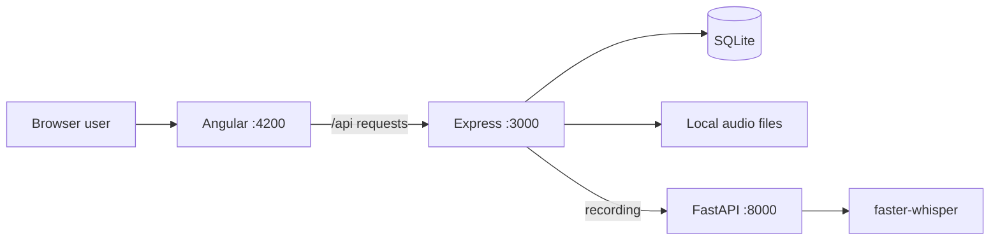

# Artikulino Architecture — Short Explanation

## 1. What the application is

Artikulino is a localhost thesis prototype for child-friendly listening and pronunciation
practice. It contains four game types, fictional child profiles, parent progress, therapist
feedback, microphone recording, and local Croatian speech transcription. It is a practice tool,
not a diagnostic or clinical system.

The codebase is made of three cooperating applications:

1. **Angular 21 frontend** — renders the interface and runs the games in the browser.
2. **TypeScript Express 5 API** — handles login, profiles, sessions, recordings, progress, and
   therapist reviews.
3. **Python FastAPI worker** — uses `faster-whisper` to transcribe Croatian recordings locally.



The browser never contacts Whisper directly. Express is the controlled boundary between the user
interface, persisted data, and transcription worker.

## 2. Repository structure

```text
src/                         Angular frontend
  app/core/                  authentication, guards, API models and services
  app/shared/                reusable recording components and browser services
  app/features/              home, games, profiles, progress and therapist pages
  main.css                   global design tokens and shared visual rules
public/assets/               game illustrations and decorative media

server/                      Express and SQLite backend
  src/app.ts                 middleware, validation and API routes
  src/database.ts            schema, migrations, queries and data mapping
  src/transcription.ts       FastAPI client, queue and text matching
  runtime/                   ignored database and recordings

transcription/               Python FastAPI worker and tests
docs/                        setup, architecture, privacy and QA documentation
```

Angular, Express, and FastAPI are separate processes, but they are kept in one repository because
they form one local prototype.

## 3. Angular frontend

The frontend starts in `src/main.ts`, which bootstraps the standalone `App` component. The root
component contains the shared header, accessibility skip link, and Angular `RouterOutlet`. Feature
pages are standalone components and are lazy-loaded through `src/app/app.routes.ts`.

Important routes are:

| Route                | Purpose                     | Access                    |
| -------------------- | --------------------------- | ------------------------- |
| `/`                  | Home page                   | Public                    |
| `/igre`              | Game catalog                | Public                    |
| `/igre/:packageId`   | Shared game player          | Parent and selected child |
| `/prijava`           | Login                       | Public                    |
| `/profili`           | Fictional profile selection | Authenticated user        |
| `/napredak`          | Parent progress             | Parent and selected child |
| `/pregled-terapeuta` | Recording review            | Therapist                 |

Angular guards check the stored role and active profile before protected routes open. Authentication
data is stored in `sessionStorage`, while active game state is kept in memory with Angular signals.
There is no NgRx or other global state library.

The main frontend services have clear responsibilities:

- `PrototypeAuthService` handles login, logout, profiles, bearer tokens, and shared API requests.
- `ContentPackagesService` exposes and filters the static game definitions.
- `GameSessionService` tracks the current question, attempts, streak, points, and completion.
- `ScoringService` calculates recognition and pronunciation points.
- `PrototypeSessionService` creates, completes, loads, and deletes persisted sessions and attempts.
- `AudioPlaybackService` plays packaged audio or falls back to Croatian browser speech synthesis.
- `MicrophoneRecorderService` wraps `MediaRecorder` and its permission/recording states.
- `TherapistReviewService` loads recordings and saves therapist feedback.

API calls use the browser `fetch()` API. During development, `proxy.conf.json` forwards `/api`
requests from Angular to Express, so the frontend does not need a hard-coded backend URL.

## 4. Content-driven game engine

Games are data-driven rather than hard-coded pages. A `ContentPackage` defines the package ID,
game type, title, target sound or pair, theme, difficulty, artwork, questions, answers, correct
answers, and scoring rules. The current definitions live in
`src/app/features/games/data/demo-content-packages.ts`.

The four supported game types are:

- `listen-and-decide` — listen and choose a category;
- `catch-the-sound` — detect a sound or distinguish a sound pair;
- `sound-position` — identify whether a sound is at the beginning, middle, or end of a word;
- `pronunciation-practice` — listen, record, replay, retry, and continue.

Every catalog card opens the same `GamePlayerPage`. The page finds the package from the URL and
selects the appropriate board component for its `gameType`. Board components mainly display the
question and emit user actions; `GamePlayerPage` coordinates playback, recording, persistence, and
navigation, while `GameSessionService` owns reusable game state.

Recognition games check the selected answer against `correctAnswerIds`. Pronunciation games have
no multiple-choice answer. They upload a recording and use the resulting text match for
proportional points:

```text
round points = round(base points × text match / 100)
```

Only the best attempt for each question contributes to the total, so a weaker retry cannot reduce
the score. The value is always labelled **Podudarnost teksta** because it compares expected and
recognized text; it is not a measurement of pronunciation quality.

Adding another game with an existing mechanic normally requires only a new content package and
its assets. A completely new mechanic also requires a new game-type value, board component,
validation rules, player branch, backend support, migration, and focused tests.

## 5. Express API and SQLite persistence

The backend starts in `server/src/index.ts` and listens on port `3000` by default.
`server/src/app.ts` creates the Express application, authentication middleware, upload handling,
request validation, route handlers, transcription queue, and final error handler.

This is **not a Spring Boot application**. The closest equivalents are:

- Express route handlers act like controllers;
- route and transcription orchestration act like services;
- `PrototypeDatabase` acts like a repository;
- TypeScript interfaces and response objects act like DTOs;
- SQLite rows act like persisted entities.

`PrototypeDatabase` creates and migrates these main tables:

- `users` and `auth_sessions`;
- `demo_children`;
- `game_sessions`;
- `recording_attempts`;
- `therapist_reviews`.

Foreign keys connect profiles to sessions and sessions to recording attempts. Cascading deletion
removes dependent database records. Recording bytes are stored as files under the Git-ignored
`server/runtime/recordings/` directory, while SQLite stores metadata and an opaque storage name.
Physical file paths are never returned by the API.

The API provides endpoints for authentication, child profiles, game sessions, attempts, protected
audio playback, and therapist review. The most important flow is:

```text
POST /api/sessions
POST /api/sessions/:id/attempts
GET  /api/attempts/:id
POST /api/sessions/:id/complete
GET  /api/sessions?childId=...
```

`GET /api/health` also reports the API contract version and supported game types. Angular checks
this before creating a session so that an outdated Express process produces a clear restart
message instead of silently failing.

## 6. Recording and transcription flow

Recording is available only in pronunciation games. A typical attempt moves through the system as
follows:

1. The child listens to the example and records through the browser `MediaRecorder` API.
2. Angular uploads the audio and question metadata as multipart data to Express.
3. Express validates the MIME type, duration, size, ownership, and required fields.
4. The file is saved locally and a `PENDING` attempt is inserted into SQLite.
5. `SerialTranscriptionQueue` sends one recording at a time to FastAPI.
6. FastAPI runs `faster-whisper` locally with Croatian language, CPU, and `int8` settings.
7. Express stores the transcript and calculates normalized Levenshtein text similarity.
8. Angular polls the attempt until it becomes `COMPLETED` or `FAILED` and then shows the result.

The worker failure does not delete the recording or invalidate the game. The user may retry or
continue without additional points. Uploads are limited to 15 seconds and 10 MB.

## 7. Authentication, progress, and therapist review

The local prototype seeds a parent account, therapist account, and fictional profiles. Passwords
are hashed with `scrypt`. Login returns a random eight-hour bearer token; only its SHA-256 hash is
stored in SQLite.

Parents can access only their profiles and sessions. The progress page combines completed game
results, attempts, transcripts, text match, protected playback, and therapist feedback. Therapists
can load completed sessions, play recordings through an authenticated endpoint, and save one of
three review states plus an optional comment.

Recognition-game accuracy and pronunciation text match remain separate. Automated text match is
not presented as therapist feedback or a clinical conclusion.

## 8. Running and validating the prototype

After installing the frontend, server, and Python dependencies, start the three processes in
separate terminals:

```bash
npm run transcription:start
npm run server:dev
npm start
```

The application is then available at `http://localhost:4200`. Express runs at
`http://localhost:3000`, and FastAPI at `http://127.0.0.1:8000`.

The complete automated quality gate is:

```bash
npm run prototype:check
```

It runs the Angular production build and tests, asset and formatting checks, Express build and
tests, and Python tests. `npm run prototype:reset` is destructive: it clears runtime sessions and
recordings before reseeding the local accounts and fictional profiles.

## 9. Main design strengths and limitations

The architecture is well suited to the current prototype because game content is configurable,
Angular features are lazy-loaded, state uses small focused services, transcription remains local,
and role/ownership checks protect adult data. Strict TypeScript, API tests, worker tests, and the
integrated quality command reduce regressions.

The main limitations are deliberate prototype trade-offs:

- Express routes and database responsibilities are concentrated in two large files.
- Frontend and backend contracts are duplicated rather than generated from one source.
- Request validation and SQLite migrations are custom and manual.
- The server trusts aggregate scores sent by the browser.
- File deletion and database deletion are coordinated but not one atomic transaction.
- The transcription queue supports one local Express process, not distributed deployment.
- Seed credentials and local-only data handling are not production account architecture.
- There is no committed full-browser end-to-end test suite.

Before production use, the project would need a separate security/privacy design, production
authentication, versioned migrations, shared runtime-validated API contracts, more modular backend
layers, professionally reviewed Croatian content, licensed audio, and full browser/device testing.

For the complete class-by-class, endpoint-by-endpoint, and data-model explanation, see
[`ARCHITECTURE_EXPLAINED.md`](ARCHITECTURE_EXPLAINED.md).
